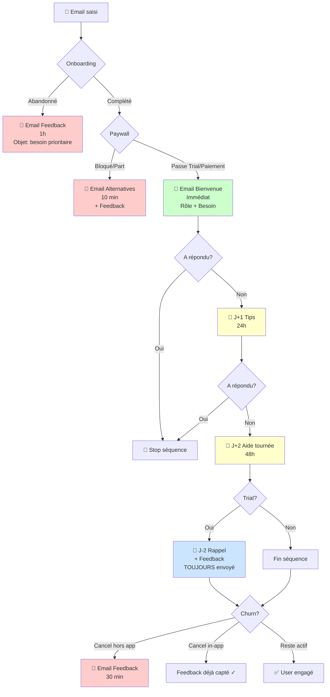
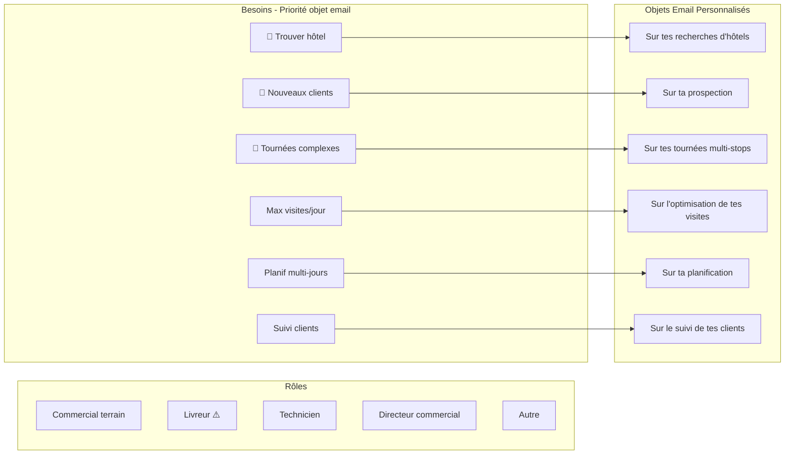
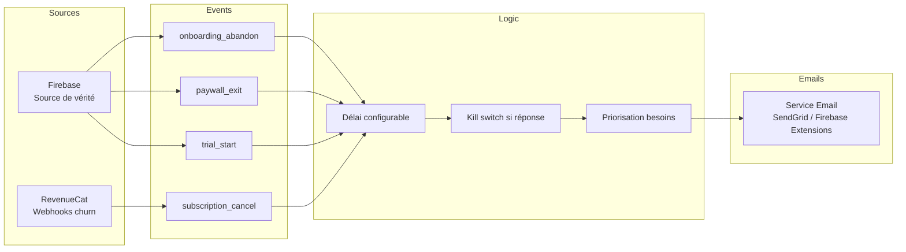

# Brainstorming Session Results

**Facilitator:** Starship
**Date:** 2026-01-12

## Session Overview

**Topic:** Système d'emails intelligents pour engagement utilisateur basé sur les événements et le comportement

**Goals:**
- Relancer les utilisateurs inactifs
- Accompagner le parcours utilisateur (onboarding, trial, paywall)
- Réduire le churn
- Collecter du feedback
- Envoyer du contenu éducatif par fonctionnalité

### Context

**Sources de données disponibles:**
- RevenueCat (abonnements, paiements, churn)
- Firebase (données app)
- Mixpanel (analytics comportementales)

**Logique intelligente requise:**
- Décisions basées sur l'état utilisateur (pas d'envoi immédiat)
- Conditions multiples : paywall passé/non, features utilisées, étape du parcours
- Emails contextuels par fonctionnalité
- Base de connaissances sur l'app pour générer du contenu

**Événements clés:**
- Inscription
- Progression/fin onboarding
- Création de tournée
- Début/fin de trial
- Blocage au paywall
- Churn
- Utilisation de features spécifiques

---

## Technique Execution Results

### Decision Tree Mapping

**Parcours utilisateur mappé :**

```
[Email saisi]
      │
      ▼
[Rôle ?]──┬── Commercial terrain
          ├── Livreur ⚠️ (churn élevé)
          ├── Technicien
          ├── Directeur commercial
          └── Autre (custom)
               │
               ▼
[Besoins ?]──┬── Max visites/jour
             ├── Suivi clients
             ├── Tournées complexes
             ├── Planif multi-jours
             ├── Trouver hôtels
             └── Nouveaux clients
                    │
                    ▼
          [Onboarding...]
                    │
                    ▼
          [Paywall] ─┬─ Passe (trial) ✓
                     └─ Bloque ✗
                           │
                           ▼
                   [Première tournée]
```

---

## Idées Générées

### Stratégies Clés

**[Stratégie #1]**: Emails de feedback, pas juste de relance
- L'objectif n'est pas toujours de faire revenir
- Transformer le churn en source d'apprentissage produit

**[Stratégie #2]**: Transparence + positionnement
- Proposer des alternatives gratuites (même si moins bonnes)
- Montre honnêteté, augmente confiance, valide la valeur du produit

**[Stratégie #3]**: L'objet = 80% du succès
- Focus sur la psychologie de l'accroche
- Personnalisation par rôle + besoin

### Règles d'Objets Email

**Framework 4 U's appliqué :**
- Urgent, Unique, Useful, Ultra-specific

**Matrice d'objets par besoin :**
| Besoin choisi | Objet possible |
|---------------|----------------|
| Max visites/jour | "Sur l'optimisation de tes visites" |
| Suivi clients | "Sur le suivi de tes clients" |
| Tournées complexes | "Sur tes tournées multi-stops" |
| Planif multi-jours | "Sur ta planification" |
| Trouver hôtels | "Sur tes recherches d'hôtels" |
| Nouveaux clients | "Sur ta prospection" |

**Priorisation besoins (si plusieurs cochés) :**
1. 🥇 Trouver un hôtel (ultra spécifique)
2. 🥈 Trouver nouveaux clients (douleur business)
3. 🥉 Tournées complexes (technique)
4. Max visites/jour
5. Planif multi-jours
6. Suivi clients

### Scénarios Email Définis

**1. Abandon Onboarding**
- Timing: 1h
- Objet: "[besoin prioritaire choisi]"
- Corps: Choix multiples + "Autre"
- Expéditeur: Personnel

**2. Paywall Bloqué**
- Timing: 10 min
- Objet: "3 alternatives gratuites pour [besoin]"
- Corps: Alternatives pourries + feedback
- Stratégie: Transparence = confiance

**3. Séquence Post-Paywall**
- J+0: Bienvenue (rôle + besoin + contexte paywall_exit si applicable)
- J+1: Tips démarrage
- J+2: Aide première tournée
- J-2: Rappel fin trial (si trial) + feedback

**4. Churn Actif**
- Timing: 30 min
- Objet: "Une question avant de partir" ou "Qu'est-ce qui n'a pas marché ?"
- Corps: Choix multiples feedback
- Cible: Cancel hors app (in-app a déjà feedback)

### Règles Système

**Kill Switch:** Arrêter séquence si user répond (sauf J-2 trial)

**Actions significatives:** Créer tournée, ajouter visites, optimiser tournée

**Extraction prénom:** Regex sur email (prénom.nom@) sinon fallback sans prénom

### Architecture Technique

**Source de données:** Firebase (pas Mixpanel - exhaustivité)
**Webhooks:** RevenueCat pour churn
**Triggers:** Events Firebase → délai → email

### Timings Récap

| Événement | Timing |
|-----------|--------|
| Abandon onboarding | 1h |
| Paywall bloqué | 10 min |
| Post-paywall J+0 | Immédiat |
| Post-paywall J+1 | 24h |
| Post-paywall J+2 | 48h |
| Fin trial J-2 | 2j avant |
| Churn actif | 30 min |

---

## Organisation Finale

### Thème 1 : Acquisition & Onboarding

| Scénario | Email | Timing | Objectif |
|----------|-------|--------|----------|
| Email saisi | - | - | Point d'entrée |
| Abandon onboarding | Feedback par besoin prioritaire | 1h | Comprendre blocage |
| Paywall bloqué | Alternatives gratuites + feedback | 10 min | Transparence + feedback |

### Thème 2 : Activation (Post-Paywall)

| Scénario | Email | Timing | Objectif |
|----------|-------|--------|----------|
| Trial/Paiement démarré | Bienvenue personnalisé (rôle + besoin) | Immédiat | Onboard |
| Inactif J+1 | Tips démarrage | 24h | Activer |
| Pas de tournée J+2 | Aide première tournée | 48h | Débloquer |

### Thème 3 : Rétention (Trial)

| Scénario | Email | Timing | Objectif |
|----------|-------|--------|----------|
| Fin trial approche | Rappel friendly + feedback | J-2 | Convertir ou feedback |

### Thème 4 : Churn

| Scénario | Email | Timing | Objectif |
|----------|-------|--------|----------|
| Cancel hors app | Feedback | 30 min | Comprendre |

---

## Arbre de Décision Complet (Mermaid)



---

## Diagramme Segmentation (Mermaid)



---

## Architecture Technique



---

## Plan d'Action

### Semaine 1 : Setup
- [ ] Choisir outil d'envoi emails (Firebase Extensions / SendGrid / Customer.io)
- [ ] Configurer events Firebase (onboarding_abandon, paywall_exit, trial_start, action_significative)
- [ ] Configurer webhook RevenueCat pour churn

### Semaine 2 : Templates
- [ ] Rédiger email "Abandon onboarding" (par besoin)
- [ ] Rédiger email "Paywall bloqué" (alternatives + feedback)
- [ ] Rédiger email "Bienvenue trial" (par rôle + besoin)
- [ ] Rédiger emails J+1, J+2, J-2
- [ ] Rédiger email "Churn feedback"

### Semaine 3 : Logic
- [ ] Implémenter triggers avec délais
- [ ] Implémenter kill switch (réponse = stop)
- [ ] Implémenter extraction prénom depuis email
- [ ] Implémenter priorisation besoins pour objet

### Semaine 4 : Test
- [ ] Tester sur petit groupe
- [ ] Ajuster timings si besoin
- [ ] Monitorer taux d'ouverture et réponse

---

## Session Summary

**Date:** 2026-01-12
**Facilitateur:** Starship
**Technique utilisée:** Decision Tree Mapping (AI-Recommended)

**Résultats clés:**
- 4 scénarios email principaux définis
- Logique de personnalisation par rôle + besoin
- Architecture technique clarifiée (Firebase > Mixpanel)
- Timings optimisés (fer chaud vs réflexion)
- Stratégie feedback-first plutôt que relance agressive

**Insights majeurs:**
1. L'objet personnalisé par besoin > objet générique
2. Proposer des alternatives "pourries" = transparence gagnante
3. Kill switch essentiel pour éviter le spam
4. 30 min pour churn = bon équilibre urgence/respect
